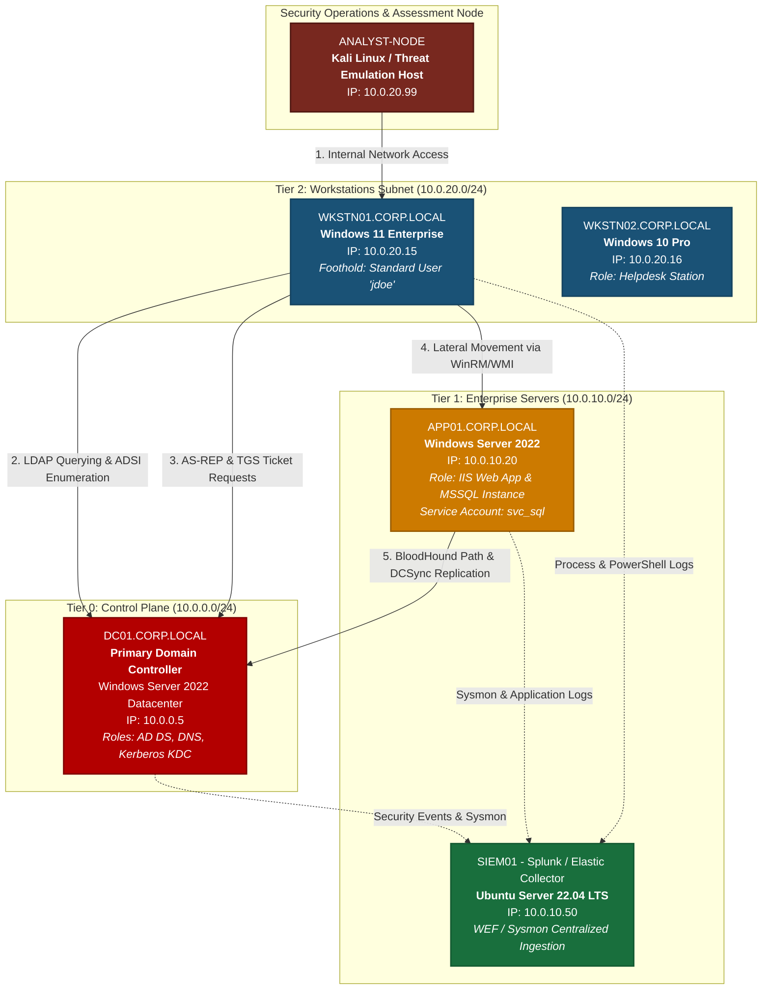
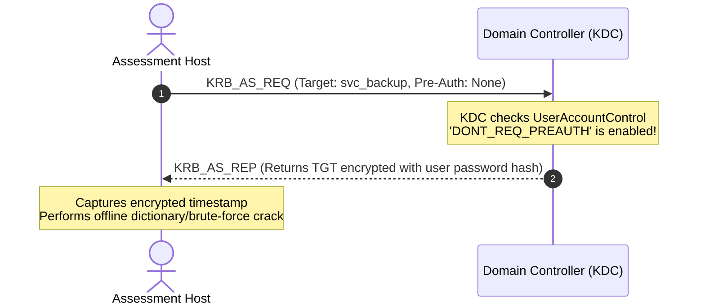
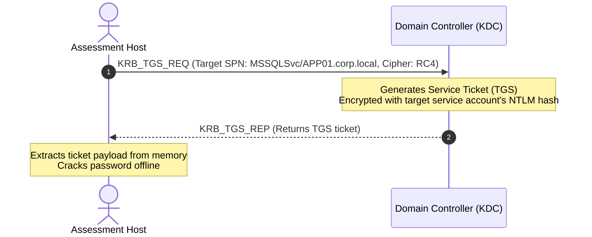

<div align="center">

# ⚔️ Enterprise Active Directory Red Team & Penetration Testing Lab
### End-to-End Attack Path Simulation, Kerberos Exploitation & Domain Compromise

[](https://attack.mitre.org/)
[](playbooks/red-team-methodology.md)
[](reports/AD_Penetration_Testing_Report.md)
[-blue?style=for-the-badge&logo=windows)](lab-architecture/topology.md)
[](LICENSE)

<br/>

**A dedicated Active Directory penetration testing and adversary emulation laboratory documenting a complete attack path from initial unprivileged workstation foothold to full Domain Controller (Tier-0) compromise.**

[Pentest Report](reports/AD_Penetration_Testing_Report.md) •
[Red Team Playbook](playbooks/red-team-methodology.md) •
[Attack Chain](#-simulated-attack-path--threat-emulation) •
[Lab Architecture](lab-architecture/topology.md) •
[Detection & Telemetry](detections/)

</div>

---

## 📑 Table of Contents

- [Executive Summary](#-executive-summary)
- [Penetration Testing Deliverables](#-penetration-testing-deliverables)
- [Lab Architecture & Target Environment](#-lab-architecture--network-topology)
- [The Offensive MITRE ATT&CK Mapping](#-mitre-attck-matrix-mapping)
- [Simulated Attack Path & Tradecraft Breakdown](#-simulated-attack-path--threat-emulation)
  - [Phase 1: Reconnaissance & LDAP Object Discovery](#phase-1-reconnaissance--ldap-object-discovery)
  - [Phase 2: Kerberos Abuse (AS-REP Roasting & Kerberoasting)](#phase-2-kerberos-abuse-as-rep-roasting--kerberoasting)
  - [Phase 3: Credential Access & Memory Architecture](#phase-3-credential-access--memory-architecture)
  - [Phase 4: Graph-Based Attack Path Mapping (BloodHound)](#phase-4-graph-based-attack-path-mapping-bloodhound)
  - [Phase 5: Lateral Movement & Domain Dominance (DCSync)](#phase-5-lateral-movement--domain-dominance-dcsync)
- [Detection Engineering & Telemetry Matrix](#-detection-engineering--telemetry-matrix)
- [Remediation & Security Baseline Audit](#-defensive-auditing-tooling)
- [Repository Structure](#-repository-structure)

---

## 📑 Penetration Testing Deliverables

This repository contains full assessment documentation suitable for academic evaluations, internal security audits, and professional portfolio demonstration:

1. 📄 [**Formal Penetration Testing Assessment Report (`reports/AD_Penetration_Testing_Report.md`)**](reports/AD_Penetration_Testing_Report.md) – Executive summary, vulnerability severity ratings (CVSS v3.1), affected assets, detailed technical findings, and risk analysis.
2. ⚔️ [**Red Team Assessment Playbook (`playbooks/red-team-methodology.md`)**](playbooks/red-team-methodology.md) – Tactical offensive tradecraft from initial recon to DCSync forest dominance.


---

## 📌 Executive Summary

Modern cyberattacks against corporate enterprises rarely exploit kernel zero-days on endpoints; instead, adversaries leverage **identity misconfigurations, legacy authentication protocols (NTLM/RC4), and permissive Active Directory Access Control Lists (ACLs)** to move laterally and compromise identity boundaries.

This project delivers a fully documented **Purple Team** simulation environment replicating an enterprise forest (`CORP.LOCAL`). It traces the operational lifecycle of a simulated intrusion starting from an initial unprivileged workstation compromise through to full Tier-0 forest dominance.

Every offensive technique is paired with:
1. **Low-level protocol & operating system mechanics** (how Kerberos, LSASS, and LDAP function under the hood).
2. **Defensive telemetry requirements** (Windows Security Event Logs, PowerShell Script Block Logging, Sysmon).
3. **Production-grade detection content** (Sigma rules, Microsoft Sentinel KQL, and Splunk SPL queries).
4. **Architectural mitigations** (Tiered Administrative Models, LAPS, Credential Guard, gMSA, and Protocol Deprecation).

---

## 🗺️ Lab Architecture & Network Topology

The lab simulates an enterprise network segmented into functional security tiers behind a virtual firewall router (`pfSense`).



---

## 🎯 MITRE ATT&CK Matrix Mapping

| Tactic | Technique ID | Technique Name | Simulation Context | Primary Defense & Telemetry |
|---|---|---|---|---|
| **Discovery** | `T1087.002` | Account Discovery: Domain Account | LDAP search queries for high-value groups & users | Event ID 4662, 1644, Sysmon ID 3 |
| **Discovery** | `T1069.002` | Permission Groups Discovery | BloodHound/SharpHound graph data collection | LDAP query profiling & RPC filtering |
| **Credential Access** | `T1558.004` | Steal/Forge Kerberos: AS-REP Roasting | Requesting TGT for accounts with `DONT_REQ_PREAUTH` | Security Event ID 4768 (PreAuthType 0) |
| **Credential Access** | `T1558.003` | Steal/Forge Kerberos: Kerberoasting | Requesting TGS tickets with RC4 encryption (`0x17`) | Security Event ID 4769 (RC4 Cipher) |
| **Credential Access** | `T1003.001` | OS Credential Dumping: LSASS Memory | Reading LSASS process memory handles | Sysmon Event ID 10, RunAsPPL, Credential Guard |
| **Credential Access** | `T1003.006` | OS Credential Dumping: DCSync | Replicating password hashes via Directory Replication | Event ID 4662 (AccessMask `0x100`) |
| **Lateral Movement** | `T1021.006` | Remote Services: Windows Remote Mgmt | Authenticated WinRM sessions across subnets | Event ID 4624 (Logon Type 3), Sysmon ID 1 |
| **Persistence** | `T1098` | Account Manipulation | Modifying ACLs & adding accounts to privileged groups | Event ID 4728, 4738, 5136 |

---

## 🔬 Simulated Attack Path & Threat Emulation

```
┌──────────────────────────────────────────────────────────────────────────────┐
│                           SIMULATED ATTACK PATH                              │
└──────────────────────────────────────────────────────────────────────────────┘
   [Phase 1] Reconnaissance & Domain Enumeration (PowerView / LDAP)
                           │
                           ▼
   [Phase 2] Kerberos Exploitation (AS-REP Roasting & Kerberoasting)
                           │
                           ▼
   [Phase 3] Local Host Privilege & Memory Infiltration (LSASS)
                           │
                           ▼
   [Phase 4] Attack Path Graph Relationship Discovery (BloodHound)
                           │
                           ▼
   [Phase 5] Lateral Movement & Forest Dominance (WinRM / DCSync)
```

### Phase 1: Reconnaissance & LDAP Object Discovery
* **Adversary Context:** Having obtained unprivileged command execution on `WKSTN01` as standard employee `jdoe`, the adversary queries the Active Directory database over Lightweight Directory Access Protocol (LDAP) without generating noisy port scanning traffic.
* **Mechanics:**
  * Active Directory Service Interfaces (ADSI) and LDAP filters (`(&(objectCategory=person)(objectClass=user))`) are executed to query user attributes.
  * Queries filter for high-value targets: privileged group memberships (`Domain Admins`, `Account Operators`), delegation rights, and service principals.
* **Detection Engineering:**
  * Enable Windows Active Directory Diagnostic Logging (Event ID `1644` - Expensive/Inefficient LDAP searches).
  * Profile anomalous spikes in client LDAP queries querying sensitive security groups within brief temporal windows.

---

### Phase 2: Kerberos Abuse (AS-REP Roasting & Kerberoasting)

#### 2.1 AS-REP Roasting Deep-Dive

* **Vulnerability Context:** Account `svc_backup` has the `Do not require Kerberos preauthentication` flag enabled (`DONT_REQ_PREAUTH`, UAC bit `0x400000`).
* **Detection:** Windows Security Event ID **`4768`** where `Pre-Authentication Type == 0` (Disabled).

#### 2.2 Kerberoasting Deep-Dive

* **Vulnerability Context:** The `svc_sql` account has a registered Service Principal Name (`MSSQLSvc/APP01.corp.local`) and uses a standard human-configured password rather than a managed service account.
* **Detection:** Windows Security Event ID **`4769`** where `Ticket Encryption Type == 0x17` (`RC4-HMAC`) for a non-machine account (service name does not end with `$`).

---

### Phase 3: Credential Access & Memory Architecture
* **Adversary Context:** Having compromised local administrative rights on `APP01`, the adversary examines credential artifacts cached inside the Local Security Authority Subsystem Service (`lsass.exe`) process memory space.
* **Mechanics:**
  * When users log on interactively or via remote desktop, credential material (NTLM hashes, Kerberos tickets, cleartext passwords in legacy SSPs like WDigest) is temporarily cached by LSASS security packages (Kerberos, NTLM, MSV1_0).
  * Dumping LSASS requires opening a process handle with `PROCESS_VM_READ` (`0x0010`) and `PROCESS_QUERY_INFORMATION` (`0x0400`).
* **Detection:**
  * **Sysmon Event ID 10 (ProcessAccess):** Trigger alert when `TargetImage` is `lsass.exe` and `GrantedAccess` includes `0x1010` or `0x1038`, originating from unauthorized binaries (excluding Windows Defender `MsMpEng.exe` or `svchost.exe`).

---

### Phase 4: Graph-Based Attack Path Mapping (BloodHound)
* **Adversary Context:** Instead of guessing permissions, the adversary runs BloodHound/SharpHound to ingest domain security descriptors and map the shortest transitive path to Tier-0.
* **Identified Attack Vector:**
  * User `helpdesk_admin` is discovered to possess explicit `GenericAll` or `WriteDacl` control over the `Tier1-Admins` group.
  * A member of `Tier1-Admins` has local administrator privileges on `APP01`.
  * An active session of `da_admin` (Domain Admin) is cached in memory on `APP01`.
  * **Shortest Path:** Standard User → Helpdesk Admin → Tier 1 Admin → Memory Credential Theft on APP01 → Domain Admin Compromise.
* **Defensive Graph Defense:**
  * Analyzing ACL edges (`GenericAll`, `WriteOwner`, `AddMember`) with defensive graph tooling to identify privilege loops before adversaries can traverse them.

---

### Phase 5: Lateral Movement & Domain Dominance (DCSync)
* **Adversary Context:** With acquired Domain Admin credentials or delegated replication permissions, the adversary executes a **DCSync** operation.
* **Mechanics:**
  * Uses the Directory Replication Service Remote Protocol (`MS-DRSR`) to impersonate a domain controller.
  * Issues `DSGetNCChanges` requests to replicate password hashes for target accounts (such as `krbtgt` or enterprise administrators) directly from `DC01`.
* **Detection:**
  * **Event ID 4662:** An object operation was performed against the domain root object containing Extended Access Rights:
    * `DS-Replication-Get-Changes` (`1131f6aa-9c07-11d1-f79f-00c04fc2dcd2`)
    * `DS-Replication-Get-Changes-All` (`1131f6ad-9c07-11d1-f79f-00c04fc2dcd2`)
  * Filter out legitimate domain controller computer accounts (`DC01$`, `DC02$`). Alerts immediately trigger on any human user or workstation IP performing replication queries.

---

## 🛡️ Detection Engineering & Telemetry Matrix

Detailed Sigma, KQL, and Splunk detection artifacts are maintained directly in the [`detections/`](./detections/) directory.

```
detections/
├── sigma-rules/
│   ├── win_security_kerberoasting.yml    # Event ID 4769 (RC4 Ticket Requests)
│   ├── win_security_asreproast.yml       # Event ID 4768 (Pre-Auth Disabled)
│   ├── win_security_dcsync.yml           # Event ID 4662 (Directory Replication Rights)
│   ├── win_sysmon_lsass_access.yml       # Sysmon ID 10 (Unauthorized Memory Access)
│   └── win_ldap_bloodhound_recon.yml     # Event ID 1644 (Mass LDAP Enumeration)
├── kql-queries/
│   └── ad_threat_hunting.kql             # Microsoft Sentinel & Defender for Endpoint queries
└── splunk-queries/
    └── ad_attack_hunting.spl             # Splunk Enterprise Security production searches
```

---

## 🛠️ Defensive Auditing Tooling

Included in this repository is **[`Audit-ADSecurityBaseline.ps1`](./hardening/Audit-ADSecurityBaseline.ps1)**, an automated, read-only defensive PowerShell auditing script that scans any Active Directory environment for the misconfigurations tested in this lab:

* 🔎 Accounts with Kerberos pre-authentication disabled (`DONT_REQ_PREAUTH`).
* 🔎 Service accounts with SPNs configured using weak encryption (RC4-capable).
* 🔎 Accounts with Unconstrained or Constrained Delegation configured.
* 🔎 Domain accounts with passwords set never to expire or sensitive accounts not protected by the `Protected Users` group.
* 🔎 Verification of Windows LAPS schema and deployment status.

---

## 🔒 Enterprise Hardening & Remediation Blueprint

The complete remediation framework is documented in [**`hardening/ad-hardening-checklist.md`**](./hardening/ad-hardening-checklist.md). Key pillars include:

```
                  ┌─────────────────────────────────────┐
                  │       ENTERPRISE ACCESS MODEL       │
                  └─────────────────────────────────────┘
                                     │
           ┌─────────────────────────┼─────────────────────────┐
           ▼                         ▼                         ▼
   ┌───────────────┐         ┌───────────────┐         ┌───────────────┐
   │    TIER 0     │         │    TIER 1     │         │    TIER 2     │
   │ Control Plane │         │ Server Plane  │         │ Workstation   │
   ├───────────────┤         ├───────────────┤         ├───────────────┤
   │ Domain Ctrls  │         │ Member Servers│         │ User Laptops  │
   │ PKI / ADFS    │         │ Databases/Apps│         │ Workstations  │
   │ Cloud Synced  │         │ Storage Arrays│         │ Mobile Devices│
   └───────────────┘         └───────────────┘         └───────────────┘
           │                         │                         │
           ▼                         ▼                         ▼
   Protected Users           gMSA Accounts             LAPS v2 Deployed
   Credential Guard          SMBv3 Encrypted           Local Admin Zero
   PAW Enforced              RC4 Deprecated            EIR Isolation
```

---

## 📂 Repository Structure

```
├── README.md                              # Core publication & architecture dossier
├── docs/                                  # Deep-dive technical whitepapers
│   ├── 01-recon-and-enumeration.md        # LDAP, ADSI, and PowerView analysis
│   ├── 02-kerberos-mechanics-and-defense.md# AS-REP & Kerberoasting deep dive
│   ├── 03-lsass-memory-and-credential-guard.md # LSA architecture, RunAsPPL & VBS
│   ├── 04-attack-paths-and-bloodhound.md  # ACL mechanics and graph analysis
│   └── 05-remediation-and-tier-model.md   # Clean Source & Tiered Administration
├── lab-architecture/
│   ├── topology.md                        # Network CIDRs, routing & VM hardware specs
│   └── ad-configuration.md                # OU structure, test accounts & baseline
├── telemetry/
│   └── sysmon-ad-profile.xml              # Production-tuned Sysmon configuration for AD
├── detections/
│   ├── sigma-rules/                       # Vendor-neutral Sigma detection rules
│   │   ├── win_security_kerberoasting.yml
│   │   ├── win_security_asreproast.yml
│   │   ├── win_security_dcsync.yml
│   │   ├── win_sysmon_lsass_access.yml
│   │   └── win_ldap_bloodhound_recon.yml
│   ├── kql-queries/
│   │   └── ad_threat_hunting.kql          # Sentinel / Defender KQL queries
│   └── splunk-queries/
│       └── ad_attack_hunting.spl          # Splunk SPL threat hunting queries
├── hardening/
│   ├── ad-hardening-checklist.md          # Comprehensive hardening checklist
│   └── Audit-ADSecurityBaseline.ps1       # Automated PowerShell security audit script
├── push_to_github.bat                     # Automation script for Git synchronization
├── LICENSE                                # MIT Open Source License
└── .gitignore                             # Ignore rules for logs, dumps & pcaps
```

---

## ⚖️ Author & Ethics Statement

**Author:** [İlkin Fərəcov](https://github.com/ferecovilkin)  
**Project Focus:** Purple Team Engineering, Threat Emulation, Detection Engineering & Active Directory Hardening.

*All activities, simulations, and telemetry captures documented in this repository were conducted within an isolated, private virtualized laboratory created exclusively for defensive education and research. This material is designed to empower security professionals, SOC analysts, and system administrators to harden enterprise directory environments against sophisticated cyber threats.*
