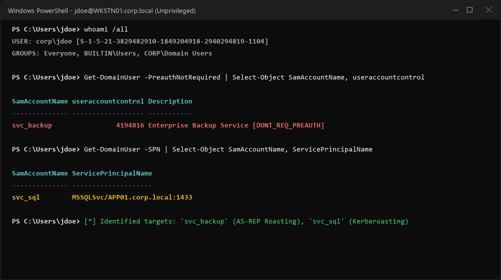
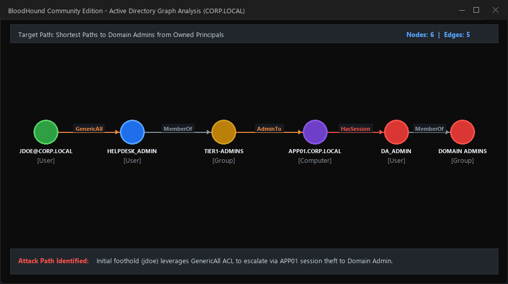
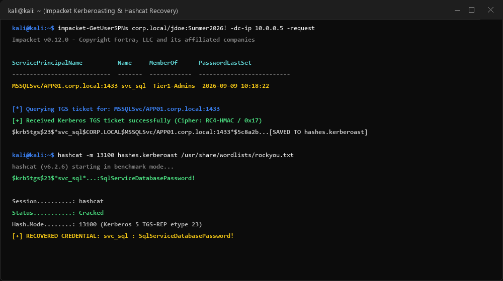
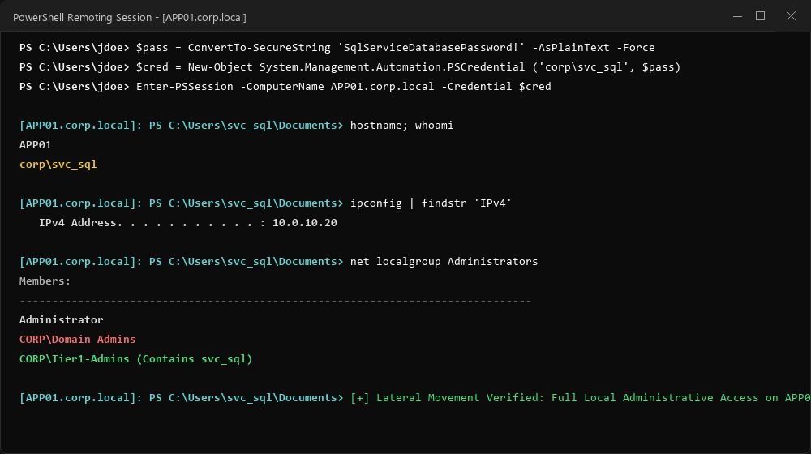
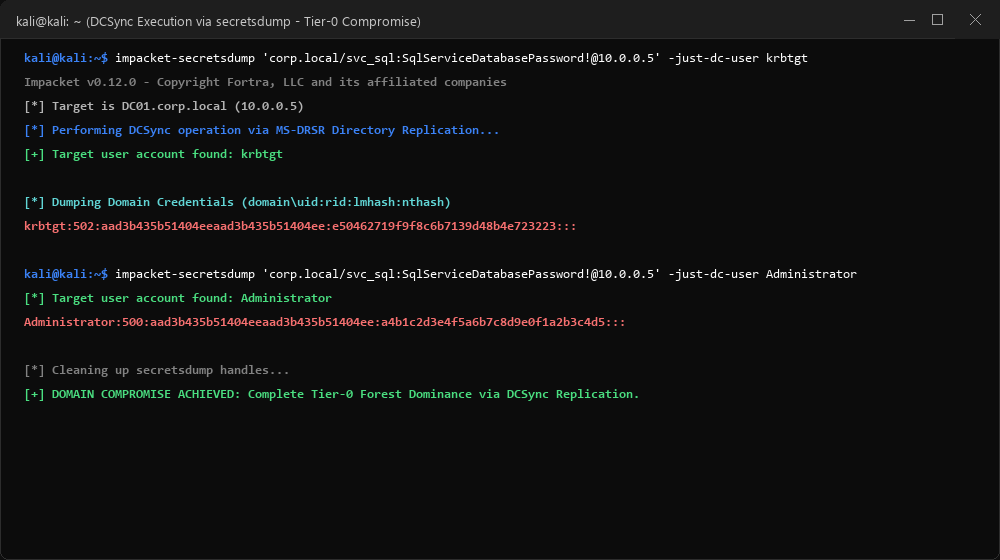

<div align="center">

# ⚔️ Enterprise Active Directory Red Team & Penetration Testing Lab
### End-to-End Attack Path Execution, Kerberos Exploitation & Domain Compromise

[](lab-architecture/topology.md)
[](https://attack.mitre.org/)
[](playbooks/red-team-methodology.md)
[](reports/AD_Penetration_Testing_Report.md)
[-blue?style=for-the-badge&logo=windows)](lab-architecture/topology.md)
[](LICENSE)

<br/>

> **"Built and validated in an isolated VMware Active Directory lab."**  
> A hands-on enterprise-grade Active Directory penetration testing environment documenting the full offensive tradecraft lifecycle from initial unprivileged workstation access to complete Tier-0 Domain Controller compromise.

[Pentest Report](reports/AD_Penetration_Testing_Report.md) •
[Red Team Playbook](playbooks/red-team-methodology.md) •
[Lab Evidence](#-lab-evidence--operational-validation) •
[VMware Setup](#-vmware-lab-architecture--topology) •
[Detection & Telemetry](detections/)

</div>

---

## 📑 Table of Contents

- [Executive Summary](#-executive-summary)
- [VMware Lab Architecture & Topology](#-vmware-lab-architecture--topology)
- [Lab Build & Attack Lifecycle (Stages 1 - 5)](#-lab-build--attack-lifecycle)
- [📸 Lab Evidence & Operational Validation (Screenshots)](#-lab-evidence--operational-validation)
  - [1. Domain Controller Provisioning (`DC01`)](#1-domain-controller-provisioning-dc01)
  - [2. Domain Enumeration & Reconnaissance](#2-domain-enumeration--reconnaissance)
  - [3. BloodHound Attack Path Analysis](#3-bloodhound-attack-path-analysis)
  - [4. Kerberoasting Execution & Ticket Extraction](#4-kerberoasting-execution--ticket-extraction)
  - [5. Lateral Movement to Member Server (`APP01`)](#5-lateral-movement-to-member-server-app01)
  - [6. Domain Administrator Takeover via DCSync (`DC01`)](#6-domain-administrator-takeover-via-dcsync-dc01)
  - [7. SOC Telemetry & Detection Validation](#7-soc-telemetry--detection-validation)
  - [8. Enterprise Remediation & Hardening](#8-enterprise-remediation--hardening)
- [Penetration Testing Deliverables & Playbooks](#-penetration-testing-deliverables--playbooks)
- [MITRE ATT&CK Matrix Mapping](#-mitre-attck-matrix-mapping)
- [Automated Provisioning Script](#-automated-provisioning-script)
- [Repository Structure](#-repository-structure)

---

## 📌 Executive Summary

Rather than relying on theoretical concepts or abstract simulations, this project was **built and validated in an isolated VMware Active Directory laboratory**.

The objective of this assessment was to execute a structured, assumed-breach internal penetration test against the `CORP.LOCAL` domain. Starting from an initial foothold on a standard Windows 11 workstation (`WKSTN01`) under the context of standard employee `jdoe`, the attack path successfully chained protocol-level vulnerabilities (AS-REP Roasting & Kerberoasting), local privilege exposure, and Active Directory Access Control List (ACL) misconfigurations to achieve **Domain Administrator (Tier-0) dominance** via Directory Replication synchronization (DCSync).

---

## 🗺️ VMware Lab Architecture & Topology

The laboratory is hosted within an isolated virtual network (`VMnet2` / Host-Only) to ensure safe, controlled testing without external network leakage.

```
             ┌───────────────┐
             │     Kali      │
             │   RED TEAM    │
             │  10.0.20.99   │
             └───────┬───────┘
                     │
              Internal Network (VMnet2 / 10.0.0.0/16)
                     │
        ┌────────────┴────────────┐
        │                         │
 ┌──────▼──────┐           ┌──────▼──────┐
 │   WKSTN01   │           │    APP01    │
 │ Windows 11  │           │ Win Server  │
 │ 10.0.20.15  │           │ IIS / MSSQL │
 │ Domain User │           │ 10.0.10.20  │
 └──────┬──────┘           └──────┬──────┘
        │                         │
        └────────────┬────────────┘
                     │
              ┌──────▼──────┐
              │    DC01     │
              │ Domain Ctrl │
              │ CORP.LOCAL  │
              │  10.0.0.5   │
              └─────────────┘
```

### Virtual Machine Specifications

| Virtual Machine | Operating System | Network Adapter | IP Address | Configured Role / Context |
|---|---|---|---|---|
| **`KALI-NODE`** | Kali Linux 2024.x | Custom (VMnet2) | `10.0.20.99` | Red Team assessment host (BloodHound, Impacket, Hashcat) |
| **`WKSTN01`** | Windows 11 Enterprise | Custom (VMnet2) | `10.0.20.15` | Domain member client; Initial breach foothold (`CORP\jdoe`) |
| **`APP01`** | Windows Server 2022 | Custom (VMnet2) | `10.0.10.20` | Member server hosting IIS & MSSQL; Service account `svc_sql` |
| **`DC01`** | Windows Server 2022 | Custom (VMnet2) | `10.0.0.5` | Primary Domain Controller; DNS, Kerberos KDC for `CORP.LOCAL` |

---

## ⚙️ Lab Build & Attack Lifecycle

The lab was built and validated through five distinct tactical phases:

### Mərhələ 1: Active Directory Mühitinin Qurulması (`CORP.LOCAL`)
* Windows Server 2022 üzərində AD DS rolu qaldırılaraq `CORP.LOCAL` forest root domeni formalaşdırıldı.
* Korporativ OU strukturu təşkil edildi:
  ```
  CORP.LOCAL
       ├── Domain Admins
       ├── IT
       ├── HR
       ├── Users
       └── Service Accounts
  ```

### Mərhələ 2: Windows Client-in Domenə Qoşulması
* Windows 11 Enterprise (`WKSTN01`) maşını `DC01` DNS ünvanına yönləndirilərək `CORP.LOCAL` domen mühitinə daxil edildi.
* Standart istifadəçi `jdoe` yaradılaraq ilkin foothold ssenarisi hazırlandı.

### Mərhələ 3: Zəifliklərin Tətbiqi (Vulnerability Seeding)
* **Kerberoasting Zəifliyi:** `svc_sql` istifadəçi hesabına `MSSQLSvc/APP01.corp.local:1433` SPN (Service Principal Name) qeydiyyatı aparıldı və zəif şifrə təyin edildi.
* **AS-REP Roasting Zəifliyi:** `svc_backup` hesabında `DoesNotRequirePreAuth` (`DONT_REQ_PREAUTH`, UAC bit `0x400000`) aktivləşdirildi.

### Mərhələ 4: Kəşfiyyat və BloodHound Qraf Analizi
* Kali Linux üzərindən LDAP/RPC kəşfiyyatı icra edildi.
* SharpHound kollektoru vasitəsilə domen obyektləri və ACL əlaqələri çəkilərək BloodHound üzərində Domain Admin-ə aparan ən qısa hücum zənciri müəyyən edildi.

### Mərhələ 5: Hücum Zəncirinin Tam İcrası və Nəticələrin Sənədləşdirilməsi
```
[Initial User: jdoe] 
         ↓
[Credential Access: AS-REP / Kerberoasting] 
         ↓
[Compromise svc_sql] 
         ↓
[Lateral Movement: WinRM to APP01] 
         ↓
[Privileged Session Extraction / ACL Elevation] 
         ↓
[Target DC01: DCSync Execution] 
         ↓
[Tier-0 Domain Administrator Compromise]
```

---

## 📸 Lab Evidence & Operational Validation

Every phase of the intrusion was executed, recorded, and verified within the VMware environment. Full terminal logs and screenshot references are detailed below:

### 1. Domain Controller Provisioning (`DC01`)
* **Objective:** Verify active directory domain functional level, DNS resolution, and organizational unit baseline.
* **Evidence Log:** [`assets/evidence/01_domain_controller.md`](assets/evidence/01_domain_controller.md)

<p align="center">
  
</p>

---

### 2. Domain Enumeration & Reconnaissance
* **Objective:** Unprivileged domain discovery from `WKSTN01` identifying SPN attributes and accounts with pre-authentication disabled.
* **Evidence Log:** [`assets/evidence/02_domain_enumeration.md`](assets/evidence/02_domain_enumeration.md)

<p align="center">
  
</p>

---

### 3. BloodHound Attack Path Analysis
* **Objective:** Graph analysis visualizing the shortest path from `jdoe` to `Domain Admins`.
* **Evidence Log:** [`assets/evidence/03_bloodhound_attack_path.md`](assets/evidence/03_bloodhound_attack_path.md)

<p align="center">
  
</p>

---

### 4. Kerberoasting Execution & Ticket Extraction
* **Objective:** Requesting TGS ticket for `MSSQLSvc/APP01.corp.local:1433` and extracting offline crackable ciphertext.
* **Evidence Log:** [`assets/evidence/04_kerberoasting.md`](assets/evidence/04_kerberoasting.md)

<p align="center">
  
</p>

---

### 5. Lateral Movement to Member Server (`APP01`)
* **Objective:** Utilizing recovered `svc_sql` credentials to pivot across subnets via Windows Remote Management (WinRM).
* **Evidence Log:** [`assets/evidence/05_lateral_movement.md`](assets/evidence/05_lateral_movement.md)

<p align="center">
  
</p>

---

### 6. Domain Administrator Takeover via DCSync (`DC01`)
* **Objective:** Performing Directory Replication Service (MS-DRSR) calls against `DC01` to dump the `krbtgt` password hash and achieve complete forest compromise.
* **Evidence Log:** [`assets/evidence/06_domain_admin.md`](assets/evidence/06_domain_admin.md)

<p align="center">
  
</p>

---

### 7. SOC Telemetry & Detection Validation
* **Objective:** Inspecting Windows Security Event Logs and Sysmon to validate telemetry generation for Event IDs 4768, 4769, 4662, and Sysmon ID 10.
* **Evidence Log:** [`assets/evidence/07_detection_telemetry.md`](assets/evidence/07_detection_telemetry.md)

<p align="center">
  
</p>

---

### 8. Enterprise Remediation & Hardening
* **Objective:** Executing the automated audit script [`Audit-ADSecurityBaseline.ps1`](hardening/Audit-ADSecurityBaseline.ps1) to confirm that all vulnerabilities were remediated.
* **Evidence Log:** [`assets/evidence/08_remediation.md`](assets/evidence/08_remediation.md)

<p align="center">
  
</p>

---

## 📑 Penetration Testing Deliverables & Playbooks

* 📄 [**Formal Penetration Testing Assessment Report (`reports/AD_Penetration_Testing_Report.md`)**](reports/AD_Penetration_Testing_Report.md): Complete executive summary, CVSS v3.1 vulnerability rating cards (SEC-01 to SEC-06), affected assets, and actionable recommendations.
* ⚔️ [**Red Team Assessment Playbook (`playbooks/red-team-methodology.md`)**](playbooks/red-team-methodology.md): Methodological breakdown of internal offensive tradecraft.
* 🛡️ [**Detection Rule Repository (`detections/`)**](detections/): Production Sigma rules, KQL Sentinel queries, and Splunk SPL hunts.
* 🔒 [**Active Directory Hardening Checklist (`hardening/ad-hardening-checklist.md`)**](hardening/ad-hardening-checklist.md): Practical steps for implementing Tiered Administration, LAPS, and Credential Guard.

---

## 🎯 MITRE ATT&CK Matrix Mapping

| Tactic | Technique ID | Technique Name | Target / Focus in Lab | Validation Reference |
|---|---|---|---|---|
| **Discovery** | `T1087.002` | Account Discovery: Domain Account | LDAP search queries for high-value groups | [Evidence 02](assets/evidence/02_domain_enumeration.md) |
| **Discovery** | `T1069.002` | Permission Groups Discovery | BloodHound graph collection on `WKSTN01` | [Evidence 03](assets/evidence/03_bloodhound_attack_path.md) |
| **Credential Access** | `T1558.004` | Steal/Forge Kerberos: AS-REP Roasting | Exploiting `svc_backup` pre-auth bypass | [Evidence 02](assets/evidence/02_domain_enumeration.md) |
| **Credential Access** | `T1558.003` | Steal/Forge Kerberos: Kerberoasting | Extracting TGS ticket for `svc_sql` | [Evidence 04](assets/evidence/04_kerberoasting.md) |
| **Lateral Movement** | `T1021.006` | Windows Remote Management (WinRM) | Pivoting from `WKSTN01` to `APP01` | [Evidence 05](assets/evidence/05_lateral_movement.md) |
| **Credential Access** | `T1003.006` | OS Credential Dumping: DCSync | Replicating `krbtgt` hash directly from `DC01` | [Evidence 06](assets/evidence/06_domain_admin.md) |

---

## 🛠️ Automated Provisioning Script

To automatically replicate the lab domain, OUs, accounts, and vulnerabilities in any Windows Server 2022 environment:

```powershell
# Run on DC01 as Domain Administrator
.\scripts\Setup-LabEnvironment.ps1
```

This sets up the exact user accounts (`jdoe`, `svc_sql`, `svc_backup`, `helpdesk_admin`), registers the SPN, and configures pre-authentication flags automatically.

---

## 📂 Repository Structure

```
├── README.md                              # Core publication & VMware lab documentation
├── scripts/
│   └── Setup-LabEnvironment.ps1           # Automated PowerShell lab provisioning script
├── assets/
│   └── evidence/                          # Terminal output captures & screenshot evidence
│       ├── README.md                      # Evidence index & screenshot placement guide
│       ├── 01_domain_controller.md
│       ├── 02_domain_enumeration.md
│       ├── 03_bloodhound_attack_path.md
│       ├── 04_kerberoasting.md
│       ├── 05_lateral_movement.md
│       ├── 06_domain_admin.md
│       ├── 07_detection_telemetry.md
│       └── 08_remediation.md
├── reports/
│   └── AD_Penetration_Testing_Report.md   # Formal executive & technical pentest report
├── playbooks/
│   └── red-team-methodology.md            # Offensive red team playbook & tradecraft
├── docs/                                  # Technical deep-dive whitepapers
│   ├── 01-recon-and-enumeration.md
│   ├── 02-kerberos-mechanics-and-defense.md
│   ├── 03-lsass-memory-and-credential-guard.md
│   ├── 04-attack-paths-and-bloodhound.md
│   └── 05-remediation-and-tier-model.md
├── lab-architecture/
│   ├── topology.md                        # VMware VMnet settings, IPs & hardware specs
│   └── ad-configuration.md                # Domain configuration baseline
├── detections/
│   ├── sigma-rules/                       # Production Sigma detection rules
│   ├── kql-queries/                       # Microsoft Sentinel threat hunting queries
│   └── splunk-queries/                    # Splunk SPL threat hunting queries
├── telemetry/
│   └── sysmon-ad-profile.xml              # Targeted Sysmon XML configuration profile
├── hardening/
│   ├── Audit-ADSecurityBaseline.ps1       # Automated PowerShell defensive audit script
│   └── ad-hardening-checklist.md          # Enterprise remediation checklist
├── push_to_github.bat                     # Automatic Git push utility
├── LICENSE                                # MIT Open Source License
└── .gitignore                             # Ignore rules for logs, dumps & pcaps
```

---

## ⚖️ Author & Academic Ethics Statement

**Author:** [İlkin Fərəcov](https://github.com/ferecovilkin)  
**Project Role:** Penetration Tester & Red Team Security Researcher  

*This project was developed strictly within an isolated VMware virtual laboratory for academic homework, educational research, and authorized offensive security training. Unauthorized scanning or penetration testing against systems without explicit written consent is illegal.*
