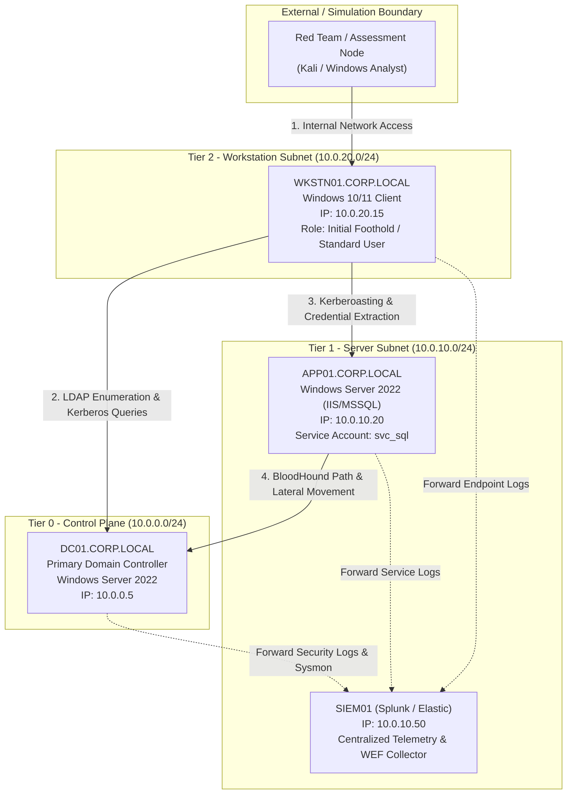

# Enterprise Active Directory Lab: Attack Path Simulation & Detection Engineering

[](LICENSE)
[](https://learn.microsoft.com/en-us/windows-server/identity/ad-ds/active-directory-domain-services)
[](#)
[](#)

---

## 📌 Executive Summary

This repository documents the architecture, attack path simulation, and defensive detection engineering for an enterprise-grade **Active Directory (AD) Lab**. 

The objective of this project is to model real-world adversary behavior following the **MITRE ATT&CK framework**, specifically tracking how misconfigurations and legacy protocols allow an attacker to transition from initial unprivileged domain access to complete Domain Dominance (Tier-0 compromise).

For each offensive vector simulated, comprehensive **telemetry sources**, **SIEM detection rules (Sigma/KQL)**, and **hardening mitigations** are documented to demonstrate an end-to-end **Purple Team** workflow.

---

## 🗺️ Lab Architecture & Network Topology

The lab replicates a realistic corporate Active Directory forest (`CORP.LOCAL`) with segmented network tiers, dedicated administrative boundaries, and active log forwarders (WEF / Splunk Universal Forwarder / Sysmon).



---

## 🎯 Simulated Attack Path & Phases

The simulated operation tracks a structured 8-phase attack path mirroring sophisticated advanced persistent threat (APT) playbooks.

```
Reconnaissance & Domain Enumeration
               ↓
     PowerView / LDAP Queries
               ↓
    Kerberos Protocol Analysis
               ↓
     Rubeus (Ticket Analysis)
               ↓
      Credential Hygiene Risks
               ↓
      LSASS & Memory Extraction
               ↓
 BloodHound Graph Relationship Mapping
               ↓
   Lateral Movement & Domain Compromise
```

### Phase 1: Recon & Active Directory Enumeration
* **Objective:** Discover domain trust relationships, user accounts, groups, operational policies, and Active Directory objects without triggering volumetric port scans.
* **Technique (MITRE T1087.002 - Account Discovery: Domain Account):**
  * LDAP query generation and ADSI inspection (simulated using standard Active Directory PowerShell modules and PowerView-style LDAP filters).
  * High-value target identification: members of `Domain Admins`, `Enterprise Admins`, and privileged custom delegated groups.
  * Identification of accounts configured with `DoesNotRequirePreAuth` (vulnerable to AS-REP Roasting).
  * Identification of user accounts with registered `ServicePrincipalName` (SPN) attributes (vulnerable to Kerberoasting).

### Phase 2: Kerberos Abuse Mechanisms (AS-REP & Kerberoasting)
* **Objective:** Exploit Kerberos ticket-granting architecture to obtain offline crackable ticket hashes for domain user and service accounts.
* **Technique (MITRE T1558.003 - Steal or Forge Kerberos Tickets: Kerberoasting):**
  * Legitimate TGS-REQ packets generated for target service SPNs (`MSSQLSvc/APP01.corp.local`).
  * Inspection of encryption types negotiated (`RC4_HMAC_MD5` vs `AES-128`/`AES-256`).
  * Analysis of service account password complexity and crackability when weak passphrases are utilized.
* **Technique (MITRE T1558.004 - AS-REP Roasting):**
  * Querying accounts with Kerberos pre-authentication disabled (`DONT_REQ_PREAUTH`).
  * Capturing encrypted AS-REP responses containing encrypted timestamps.

### Phase 3: Credential Access & Memory Extraction
* **Objective:** Uncover cleartext credentials, NTLM hashes, and Kerberos tickets stored in memory on compromised endpoints.
* **Technique (MITRE T1003.001 - OS Credential Dumping: LSASS Memory):**
  * Evaluation of Local Security Authority Subsystem Service (`lsass.exe`) process memory protections.
  * Testing detection mechanisms around unauthorized process handles with `PROCESS_VM_READ` or `PROCESS_ALL_ACCESS` rights.
  * Analysis of credential reuse across local administrator accounts vs LAPS enforcement.

### Phase 4: Graph-Based Attack Path Analysis (BloodHound)
* **Objective:** Map hidden administrative relationships, transitive access rights, Object Control (ACLs), and session tokens across the entire domain.
* **Technique (MITRE T1069.002 - Permission Groups Discovery):**
  * Execution of BloodHound data collection (evaluating LDAP search queries, local admin enumeration via SAM-R, and session collection via NetSessionEnum).
  * Identification of ACL misconfigurations:
    * `GenericAll` / `GenericWrite` over user or computer objects.
    * `WriteDacl` / `WriteOwner` privileges granting privilege escalation paths.
    * Active high-privilege sessions cached on low-tier workstation nodes.

### Phase 5: Lateral Movement & Privilege Escalation
* **Objective:** Leverage acquired credentials or ticket materials to traverse network tiers and execute commands on higher-tier infrastructure.
* **Technique (MITRE T1021.002 - SMB/Windows Admin Shares & T1021.006 - Windows Remote Management):**
  * WMI and WinRM remote execution verification.
  * Testing Pass-the-Hash (PtH) and Overpass-the-Hash dynamics.
  * Reaching Tier-0 Domain Controller assets via targeted privilege escalation.

---

## 🛡️ Detection Engineering & Telemetry Matrix

| Phase | Relevant Event IDs | Telemetry Source | Primary Indicator / Detection Focus |
|---|---|---|---|
| **Recon / LDAP** | Event ID 4662, 1644 | AD DS Diagnostic Logs | Volumetric anomalous LDAP searches, anomalous query filters |
| **AS-REP Roasting** | Event ID 4768 | Security Event Log | TGT requested with Pre-Authentication Type `0` (Disabled) |
| **Kerberoasting** | Event ID 4769 | Security Event Log | TGS ticket requested with Ticket Encryption `0x17` (RC4) for non-machine accounts |
| **LSASS Access** | Sysmon Event ID 10 | Microsoft-Windows-Sysmon | Process access to `lsass.exe` with `GrantedAccess` including `0x1010` / `0x1038` |
| **Process Creation** | Event ID 4688, Sysmon ID 1 | Security / Sysmon | PowerShell launched with suspicious base64 arguments or script blocks |
| **Privilege Use** | Event ID 4672, 4624 | Security Event Log | Special privileges assigned to new logon (`SeDebugPrivilege`, `SeTcbPrivilege`) |
| **Lateral Movement** | Event ID 4624 (Logon Type 3) | Security Event Log | Network logons using NTLM authentication instead of Kerberos |

See the [`detections/`](./detections/) folder for production-ready **Sigma** and **KQL** rules.

---

## 🔒 Hardening & Remediation Roadmap

To neutralize the simulated attack chain, the following enterprise security controls were implemented and validated:

1. **Active Directory Tiering & Clean Source Principles:**
   * Enforce rigid separation between Tier 0 (Domain Controllers, PKI), Tier 1 (Enterprise Servers), and Tier 2 (Endpoints/Users).
   * Prohibit Domain Admin credentials from ever authenticating to or caching on Tier 1 or Tier 2 machines.

2. **Windows LAPS (Local Administrator Password Solution):**
   * Automatically randomize and rotate unique local administrator passwords on all workstations and member servers, eliminating credential pivoting.

3. **Kerberos Hardening:**
   * Transition all service accounts with SPNs to **Group Managed Service Accounts (gMSA)** with 128-character automatically rotated passwords.
   * Disable legacy RC4 encryption forest-wide; enforce AES-128 and AES-256 encryption.
   * Verify all active user accounts have `Do not require Kerberos preauthentication` unchecked.

4. **Endpoint Credential Isolation:**
   * Enable **Credential Guard** (Virtualization-Based Security / VBS) to isolate LSASS secrets into an isolated virtual container.
   * Enforce `RunAsPPL` (Protected Process Light) on `lsass.exe` to prevent non-protected processes from attaching debug hooks.

5. **Privileged Access Management (PAM) & Protected Users:**
   * Add high-privilege administrative accounts to the **Protected Users** security group (disables NTLM caching, DES/RC4 encryption, and limits delegation).

---

## 📂 Repository Structure

```
├── README.md                      # Comprehensive project documentation & purple team overview
├── lab-architecture/
│   ├── topology.md                # Network architecture, IP allocation, and VM specifications
│   └── ad-configuration.md        # OU hierarchy, GPOs, and service account specifications
├── detections/
│   ├── sigma-rules/
│   │   ├── win_security_kerberoasting.yml
│   │   └── win_sysmon_lsass_access.yml
│   └── kql-queries/
│       └── ad_threat_hunting.kql
├── hardening/
│   └── ad-hardening-checklist.md  # Production hardening recommendations
└── .gitignore                     # Git ignore rules for logs, pcaps, and dumps
```

---

## ⚠️ Disclaimer

This project was developed strictly within an isolated, self-hosted virtualization laboratory for authorized educational, defensive research, and detection engineering purposes. Unauthorized scanning, testing, or exploitation of computer systems without explicit written permission is strictly prohibited by law.
