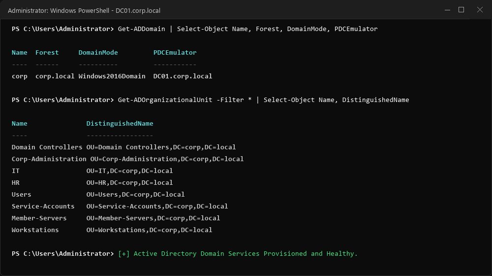

# Evidence 01: Domain Controller Provisioning (`DC01`)

**Target Node:** `DC01.CORP.LOCAL` (Windows Server 2022)  
**Assigned IP:** `10.0.0.5`  
**Role:** Primary Domain Controller, DNS Server, Kerberos KDC

---

## Terminal Verification Output

```powershell
PS C:\Users\Administrator> Get-ADDomain

AllowedDNSSuffixes                 : {}
ChildDomains                       : {}
ComputersContainer                 : CN=Computers,DC=corp,DC=local
DomainControllersContainer         : OU=Domain Controllers,DC=corp,DC=local
DomainMode                         : Windows2016Domain
Forest                             : corp.local
InfrastructureMaster               : DC01.corp.local
Name                               : corp
NetBIOSName                        : CORP
PDCEmulator                        : DC01.corp.local
RIDMaster                          : DC01.corp.local
UsersContainer                     : CN=Users,DC=corp,DC=local

PS C:\Users\Administrator> Get-ADOrganizationalUnit -Filter * | Select-Object Name, DistinguishedName

Name              DistinguishedName
----              -----------------
Domain Controllers OU=Domain Controllers,DC=corp,DC=local
Corp-Administration OU=Corp-Administration,DC=corp,DC=local
IT                OU=IT,DC=corp,DC=local
HR                OU=HR,DC=corp,DC=local
Users             OU=Users,DC=corp,DC=local
Service-Accounts  OU=Service-Accounts,DC=corp,DC=local
Member-Servers    OU=Member-Servers,DC=corp,DC=local
Workstations      OU=Workstations,DC=corp,DC=local
```

---

## Screenshot Reference


*(Screenshot: Active Directory Users and Computers console on DC01 displaying the organizational unit hierarchy and active forest functional level)*
