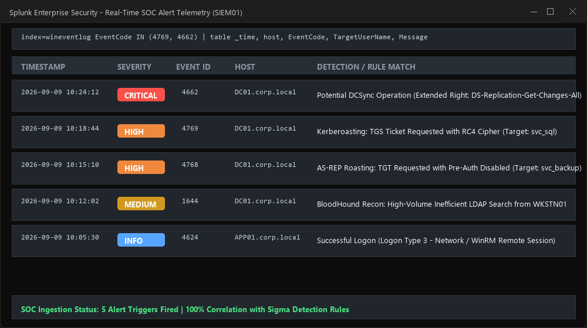

# Evidence 07: Telemetry & SOC Detection Validation

**Telemetry Sources:** Windows Security Event Log on `DC01`, Sysmon on `APP01`  
**Ingestion Node:** `SIEM01` (Splunk Enterprise)  
**Alert Validation:** Matching Sigma rule signatures for Kerberoasting and DCSync

---

## Event Log Evidence

### Event ID 4769 - Kerberoasting Detection
```xml
<Event xmlns="http://schemas.microsoft.com/win/2004/08/events/event">
  <System>
    <Provider Name="Microsoft-Windows-Security-Auditing" Guid="{54849625-5478-4994-A5BA-3E3B0328C30D}" />
    <EventID>4769</EventID>
    <Level>0</Level>
    <Task>14337</Task>
    <Computer>DC01.corp.local</Computer>
  </System>
  <EventData>
    <Data Name="TargetUserName">svc_sql@CORP.LOCAL</Data>
    <Data Name="ServiceName">MSSQLSvc/APP01.corp.local:1433</Data>
    <Data Name="TicketOptions">0x40810000</Data>
    <Data Name="TicketEncryptionType">0x17</Data>
    <Data Name="IpAddress">::ffff:10.0.20.15</Data>
  </EventData>
</Event>
```

### Event ID 4662 - Directory Replication (DCSync)
```xml
<Event xmlns="http://schemas.microsoft.com/win/2004/08/events/event">
  <System>
    <EventID>4662</EventID>
    <Computer>DC01.corp.local</Computer>
  </System>
  <EventData>
    <Data Name="SubjectUserName">svc_sql</Data>
    <Data Name="ObjectName">DC=corp,DC=local</Data>
    <Data Name="AccessMask">0x100</Data>
    <Data Name="Properties">{1131f6ad-9c07-11d1-f79f-00c04fc2dcd2}</Data>
  </EventData>
</Event>
```

---

## Screenshot Reference


*(Screenshot: Splunk dashboard displaying real-time alerts fired for Event ID 4769 RC4 ticket request and Event ID 4662 replication access)*
