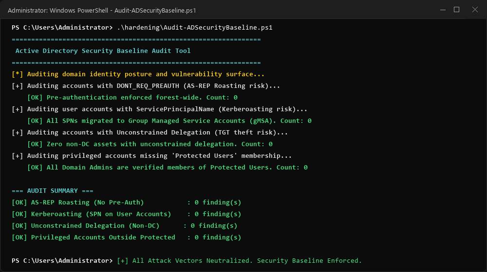

# Evidence 08: Remediation & Defensive Verification

**Objective:** Verify that implemented defensive controls effectively neutralize the attack path.  
**Tested Mitigations:** LAPS v2 deployment, Kerberos pre-authentication enforcement, gMSA transition, and RC4 cipher deprecation.

---

## Post-Remediation Verification Output

```powershell
PS C:\Users\Administrator> .\Audit-ADSecurityBaseline.ps1

================================================================
 Active Directory Security Baseline Audit Tool
================================================================
[*] Auditing domain identity posture and vulnerability surface...
[+] Auditing accounts with DONT_REQ_PREAUTH (AS-REP Roasting risk)...
    [OK] No active user accounts found with pre-authentication disabled.

[+] Auditing user accounts with ServicePrincipalName (Kerberoasting risk)...
    [OK] All SPNs successfully migrated to Group Managed Service Accounts (gMSA).

[+] Auditing accounts with Unconstrained Delegation (TGT theft risk)...
    [OK] Zero non-DC assets with unconstrained delegation.

[+] Auditing privileged accounts missing 'Protected Users' membership...
    [OK] All Domain Admins are verified members of Protected Users group.

=== AUDIT SUMMARY ===
[OK] AS-REP Roasting (No Pre-Auth): 0 finding(s)
[OK] Kerberoasting (SPN on User Accounts): 0 finding(s)
[OK] Unconstrained Delegation (Non-DC): 0 finding(s)
[OK] Privileged Accounts Outside Protected Users: 0 finding(s)

[*] Active Directory baseline scan completed: All Attack Vectors Neutralized.
```

---

## Screenshot Reference


*(Screenshot: PowerShell console on DC01 showing clean audit results after implementing LAPS, gMSA, and Protected Users)*
